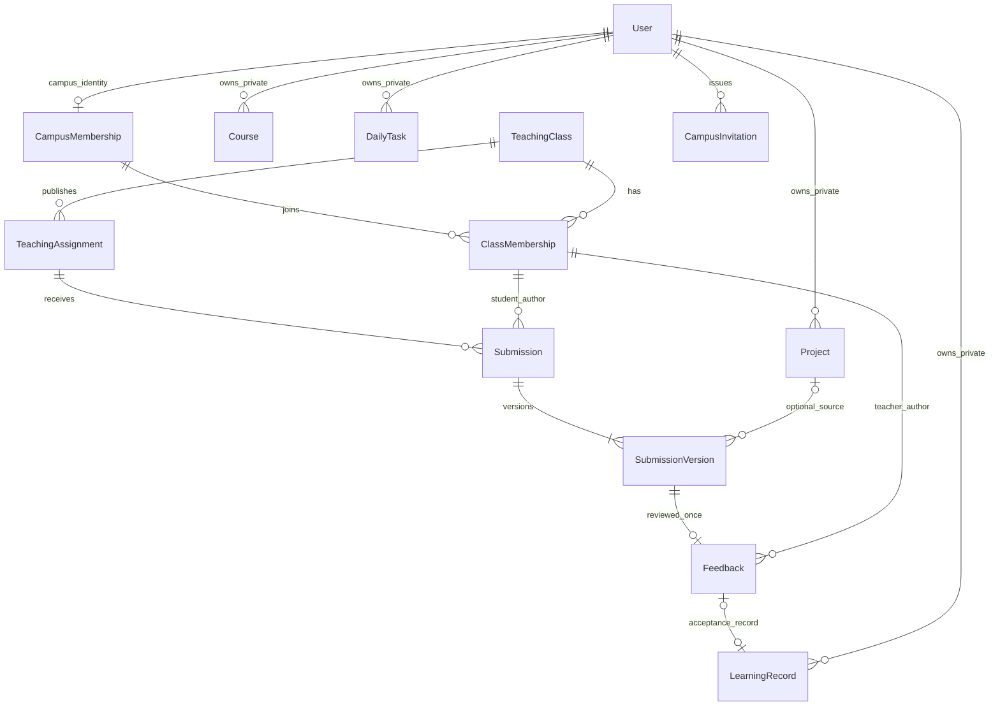

# P16 校园试点最小方案与数据设计草案

日期：2026-09-05，UTC+08:00；2026-09-09 更新确认状态。状态：**设计草案已获用户技术确认并完成 P17-P19 隔离开发验收；尚未获得教师确认或校方试点批准。**

本文件是本阶段唯一设计正文，覆盖现状、权限、数据、接口、阶段依赖及确认清单。只读检查代码，不运行业务测试、访问数据库、调用模型、启动服务、执行迁移或创建账号。下文所有新增字段、接口及流程均为建议，不是已实现能力。

## 1. 现状与证据

### 1.1 核对基线

- 起始 Git：`main`，HEAD `3b797bacdad1a00022f1e7b26d8764fbf542b4d5`；只读 `git ls-remote` 显示起始 `origin/main` 相同。暂存区为空，工作区有此前未提交的 AI 工作流、教学节点、项目库排版和文档改动。此次设计以当前工作区为准，提交设计不会顺带提交这些代码。
- 仓库及工作区父目录未发现本地 `AGENTS.md`；遵循会话提供的全局规则和全局 `AGENTS.md`，以及指定的两个 Skill。
- 已读根 README、文档 README、项目说明、前后端目录职责、AI 提示词 README、P15 交付报告和 2026-09-05 工作流/排版报告。目录职责文档是规划性描述，其中 Redis、多供应商等不能当作已安装能力。
- `frontend/package.json`、`frontend/pnpm-lock.yaml`、`backend/requirements.txt` 与现有代码确认技术栈；沿用 pnpm 锁文件，不调整依赖。新旧身份共用 Vue 前端，后端保持 Router → Service → Repository → SQLAlchemy → MySQL；保留现有 Provider、Agent 和 Workflow Engine。

### 1.2 实际能力分类

| 分类 | 已核对事实 | 可达证据 |
| --- | --- | --- |
| 已实现：个人账号 | 注册、滑块登录、JWT、本人资料；每次受保护请求查 User 与 is_active | `backend/app/api/v1/auth.py`、`users.py`；`services/auth.py`；`api/deps.py`；前端 `/login`、`/register`、`/profile` |
| 已实现：个人学习与项目 | Course 归 owner；instructor 只是字符串。LearningPlan、DailyTask、LearningRecord、Project 都按个人授权 | `models/course.py`、`learning.py`、`project.py`；`services/course.py`、`learning.py`、`project.py`；前端 `/projects`、`/workspace/*`、`/learning`、`/learning/tasks`、`/learning/records` |
| 已实现：社区 | 项目主动发布/取消发布、专用社区响应、评论/点赞/收藏；目前没有学校成员隔离与审核状态 | `api/v1/community.py`、`repositories/community.py`、`schemas/community.py`；前端 `/community`、`/community/projects/:id` |
| 已实现：工作流 AI 页面 | 图编辑、运行/保存并运行、历史与结构化结果、自动准备 Context；原三种分析节点加三种教学节点 | `frontend/src/views/WorkflowEditorView.vue`、`components/WorkflowExecutionPanel.vue`；`backend/app/api/deps.py`、`workflow/engine.py`、`workflow/agents.py`；后续改动尚未提交 |
| 已实现：统计与个人 AI 报告 | ECharts 统计、当前用户报告生成和回读；报告是快照 | 前端 `/analytics`、`api/analytics.ts`；`api/v1/statistics.py`、`learning_reports.py` |
| 仅有独立 API | Provider `/ai/test`；Agent `/agents/project-analysis`、`/agents/prompt`、`/agents/project-review`、`/agents/results/{request_id}`；Context 通用读写与节点权限读写 | `backend/app/api/v1/ai.py`、`agents.py`、`project_context.py`；前端只有工作流 Context 准备，未见对应通用编辑/独立 Agent 页面 |
| 尚未实现 | 校园资格、固定角色、邀请、教师/管理员核验与初始化、改密/重置、服务端会话撤销管理；班级、教学任务、提交版本、反馈、通知、社区治理、按人/校园计费额度 | 实际 Router、Models、前端路由无相应实体和入口；User 只有 is_active，JWT 只有 sub/iat/exp，没有角色或会话版本 |
| 待外部确认 | 学校、课程、教师及负责人、学生规模和参与依据、预算、服务器、数据规则与试点批准 | 未提供可核对的确认记录，不能从本地演示数据或 P16-P24 提示词推断 |

数据库文件核对：`backend/schema.sql` 定义 19 张现有表；`backend/migrations/` 只有 `20260902_p14_statistics.sql`。现有 `UTCDateTime` 对 MySQL 使用 UTC `DATETIME(6)`。本次没有连库，**文件一致性检查不代表实际数据库结构已核验**。P15 的历史测试与后续报告的 160 项测试是既往记录，本阶段未重新运行。

P15 曾说明工作流运行只通过 Swagger；当前工作区已补齐页面，因此 P20 只补剩余独立 Agent/Context/Prompt 页面。质量检查节点仍不可执行。AI 静态评审不会运行代码。

## 2. 试点范围、负责人和最小链路

| 项目 | 草案边界 | 当前确认状态 |
| --- | --- | --- |
| 学校、试点负责人及批准联系人 | 一所学校；负责人负责招募、协调、停用及争议处理 | 姓名、机构、联系方式及授权来源均待确认 |
| 课程、教师、班级 | 一门项目实践课程、一个教学班；课程名/学期/任务由真实教师确认 | 均待确认，不以 Course.instructor 认定身份 |
| 学生 | 一班受邀学生，人数、年龄范围、是否含未成年人及自愿参加方式由校方确认 | 均待确认；不推测名单、不导入真实学生数据 |
| 访问方式 | 推荐先在受控校内/VPN 环境，以一个应用实例试点；仍需 HTTPS | 网络、域名、设备、服务器与访问人群待确认；localhost 成功不是可上线证据 |
| AI 费用 | 推荐明确的项目/校方预算账户支付，学生不提交个人 Key；人工设总额和个人限额 | 实际付款者、上限、超额处理均待确认；现有 Key 不代表试点付费授权 |
| 技术维护 | 指定维护者负责部署、备份、故障响应、秘密管理和供应商配置 | 人员、可用时段、响应目标待确认 |
| 试点周期与成功标准 | 推荐 2–4 周，至少两项任务和一次真实退回修改；具体目标按人数确认 | 只是建议，未发生任何课堂观察 |

最小闭环：教师发布 TeachingAssignment → 学生提交 SubmissionVersion → 教师对指定版本留 Feedback（通过或退回）→ 学生修改后提交新版本 → 通过反馈形成一条本人 LearningRecord → 学生另外选择是否把脱敏作品发布校园社区。

教学通过不等于 Project 完成，不修改 DailyTask 状态、不填充学习分钟、不自动公开作品；AI 生成与否不决定成绩或通过。初期只有文字、仓库链接和可选版本标识，不上传文件、不抓取仓库、不执行代码、不做自动评分。

## 3. 身份、邀请和会话

### 3.1 最小身份方案（待确认 D1）

保留现有 User、ID、密码、个人课程/项目/笔记。新增一校范围的 CampusMembership，只有 `student / teacher / administrator` 三个固定角色；没有校园资格的旧账号仍是个人用户，不增设第四种校园角色。一人本试点只持有一个校园角色；管理员若也承担教学，应另行确认角色冲突方案，不能隐式获得教师权限。

登录仅证明 User 身份；校园业务权限还要求 `User.is_active=true`、`CampusMembership.status=active`、对应班级成员有效。唯一留存例外是有效 User 对本人历史提交/反馈的保留期只读与本人导出，允许在退出校园或班级后继续使用，不能读取其他教学资源。JWT 不作为角色权威，每个校园请求实时查询资格和班级关系。旧 Course 永远不自动转为 TeachingClass。

推荐保留无邀请的个人注册协议，校园加入必须邀请；也可选择试点部署关闭普通注册，但会影响旧客户端。无邀请注册不获得校园资格，表单不能自选角色。校园社区后续需另设资格门槛，现有“已登录可见”不能冒充“仅本校可见”。这些取舍需在 P17/P21 分别确认。

### 3.2 受控邀请与生命周期

- 首位管理员：维护者在获得明确人员授权后，用受控管理命令对指定已核验 User 初始化；交互确认、事务锁定“尚无有效管理员”、记录审计。不内置密码、不提升第一位注册者；P16 不运行此操作。
- 管理员可核验并邀请学生、教师；新增管理员采用同等受控、记名的管理员授予流程，不发可转赠的管理员邀请码。禁止停用/撤销最后一位有效管理员。
- P18 班级加入使用已通过 P17 核验的校园身份编号；教师只可向本人有效班级加入学生，管理员可安排教师或学生，不扩展第二套邀请凭证。
- 邀请绑定已存在 target_user_id，或线下核验的 target_email（二选一）；建议有效 72 小时、一次使用。随机高熵原始凭证仅交付一次，数据库存摘要，日志不存链接/凭证。教师/管理员线下核验后定向交付；仅控制邮箱或知道邀请 ID 不代表教师身份。
- 旧用户登录后兑换，维持原 User ID；新用户使用匹配邮箱注册后兑换，也可由带 invite_token 的注册在同一事务完成。注册/兑换不覆盖旧用户名、邮箱或私人数据，资格冲突拒绝，不静默换角色。
- 并发兑换锁邀请行、检查用途/有效期/绑定人/发放者仍有权限及班级开放状态；唯一约束兜底。一次事务写校园/班级成员及消费状态。重复由同一人兑换返回已有结果，其他人拒绝。过期、撤销均不可使用。
- 密码修改校验当前密码；忘记密码先由管理员核验身份，再发给绑定 User 的一次性短期重置凭证（建议 30 分钟）。管理员不能查看原密码，也不能设置人人相同的默认密码。
- 推荐给 User 新增 `auth_version`：新 JWT 带版本号；改密、重置、全会话退出、停用或角色撤销在事务内递增。每次请求对照数据库，旧版本返回 401；停用账号拒绝登录/访问。角色提升也撤销旧会话，重新登录生效。初始化版本缺失的旧 JWT 在切换时统一失效，旧账号和数据保留，但需要重新登录。
- `校园资格 suspended/revoked` 仅撤销校园权限并递增会话版本；重新登录仍可按既有个人边界访问资料。`User.is_active=false` 是全账号停用，私人入口也不可用。两种管理操作分开命名与确认。
- 离开班级只撤销班级权限；校园资格和其他班级不受影响。教师退出/停用后立即不能查看班级提交，历史署名保留；最后一位教师退出前先指定已核验接任者或归档班级。

只做全会话撤销，不建立多设备会话管理平台。请求进入事务时复核权限；撤销后新请求必须失败。已发给供应商的数据无法撤回，长 AI 请求结束时仍要复核读取/返回权限，具体停止和费用规则到 P20/P22 实施。

## 4. 权限矩阵

默认拒绝。角色仅是第一层；Service 和 Repository 必须同时限制主体、资源 ID、校园资格、班级关系和状态。下表“教师”均指当前有效任课教师；“管理员”不能绕过私人资源所有权。

| 主体 | 资源 | 动作 | 授权范围/拒绝边界 |
| --- | --- | --- | --- |
| 所有已有个人账号 | 自己的 Course、DailyTask、Project、LearningRecord、Context、AI 输入/结果 | 原有读写 | 仅 owner/user；CampusMembership 缺失不改变私人所有权 |
| 学生 A | 学生 B 的私人数据、Submission、Feedback | 任何读取/修改 | 拒绝，即使同班；学生提交列表只返回本人 |
| 学生 | TeachingClass、TeachingAssignment | 读取 | 当前有效成员仅看所属 active/archived 班级的已发布/归档任务；不看教师草稿，不提供同学邮箱/提交名册 |
| 学生 | 本人 Submission/Version | 创建、重交、查看 | 有效学生成员、任务 published 且未截止时可提交；历史本人快照/反馈可在退出后按留存期只读；不得替别人提交 |
| 学生 | 已交快照与 Project 关联 | 取消关联/申请删除 | 只能本人；取消关联不扩大教师权限，也不自动删除教学证据，见第 6 节 |
| 本班教师 | TeachingClass、成员、任务 | 查看名册、邀请学生、发布/归档任务 | 仅本人有效教学关系；名册最小为展示名、校园成员 ID、状态，不返回私人资料或邮箱 |
| 本班教师 | SubmissionVersion、Feedback | 读取提交、反馈、退回/通过 | 仅本班已提交快照；历史学生退出后已交证据仍可按期读取；无权调用其 `/projects/{id}`、Context、私人记录或 AI 原始结果 |
| 其他班教师/非任课教师 | 本班名册、任务草稿、提交、反馈 | 读写 | 拒绝；即使知道 assignment_id/submission_id/version_id 也不能越权 |
| 教师 | 自己或学生私人项目 | 创建教学副本/读取 | 自己的原有数据可读；学生项目只能从明确提交的白名单快照看，不走原 Project 授权 |
| 管理员 | User 必要账号资料、CampusMembership、邀请、班级管理元数据 | 核验、角色授予/撤销、停用、安排教师、归档 | 仅账号 ID、用户名、核验所需邮箱、角色/状态、操作记录；不提供密码哈希、私人正文、Context 或 AI 输入 |
| 管理员 | 公开作品与举报 | 审核/下架/复核 | P21 专用公开响应和治理记录；不因治理去查询未发布私人项目；不审核教学提交/反馈 |
| 管理员 | 私人笔记、AI 输入/报告、教学提交 | 批量查看/导出 | 默认拒绝；用户协助请求与校方核准的数据处理必须另设目的和范围，不靠管理员全表接口 |
| 学生/教师 | 本人 AI 报告 | 生成、查看、导出 | 本人；学生可自选脱敏摘录写入提交，不授权教师读取报告全文或原始输入 |
| 有效校园成员 | 自愿公开作品 | 浏览与互动 | P21 完成校园范围治理后，仅公开字段；可见不等于修改权；发布与教学是否通过独立 |
| 技术维护者 | 备份/系统故障资料 | 受控运维 | 不是额外产品角色；基础设施权限单独授权、审计；应用管理员权限不等于数据库权限 |

授权失败沿用既有 401/403/404 语义并脱敏；班级列表查询先过滤作用域。资源不存在或不可披露时统一 404，不通过计数、通知或错误正文暴露其他班信息。

## 5. 核心数据设计（只设计，不建表）

### 5.1 命名、关系与 ER

`Course / DailyTask / Project` 保持个人含义。`TeachingClass` 直接承载本次课程名与学期，不增加 School、Department、TeachingCourse 等组织平台表。`ClassMembership` 表示该 User 参加哪个教学班，`TeachingAssignment` 是教师发布的任务，`Submission` 是一名学生对一个任务的提交串，`SubmissionVersion` 是一次不可覆盖的成果快照，`Feedback` 针对明确版本。

ER 中 TeachingClass 教师关系与学生关系同用 ClassMembership；Feedback 的 review 行为在表约束及 Service 中限制为 teacher。邀请通过 consumed_by_user_id 关联兑换者，可用于已有校园成员加入新班，此时不新建 CampusMembership，不额外建立邀请与资格的循环外键。

### 5.2 通用约定

- 新 ID 沿用 BIGINT UNSIGNED；MySQL InnoDB、utf8mb4；所有新事件时间用 `UTCDateTime`/`DATETIME(6)`，API ISO 8601 带时区，前端按 Asia/Shanghai 显示。不从旧日期伪造事件时间。
- 表默认 `id PK, created_at, updated_at`；不可变版本/反馈只需 created_at/事件时间。字符串状态使用固定允许值与数据库 CHECK/现有 enum_type 约定，不新增权限字典表。
- 可变实体 `revision INT NOT NULL DEFAULT 1`，更新必须 expected_revision，竞争返回 409。分页沿用 `page/page_size`，默认 20、最大 100，稳定按时间和 ID 排序。
- 新校园/教学外键原则上 `ON DELETE RESTRICT`，通过状态退出/归档。只有可选 Project 来源及本人学习记录链接用 `SET NULL`；不从私人项目删除级联清空提交。

### 5.3 字段、唯一约束和索引

建议物理表名依次为 `campus_memberships`、`campus_invitations`、`password_resets`、`account_audits`、`teaching_classes`、`class_memberships`、`teaching_assignments`、`submissions`、`submission_versions`、`feedbacks`、`notifications`；下表和 ER 使用对应单数模型名，既有 `users`、`projects`、`learning_records` 保持原名。

| 实体/阶段 | 字段职责（除公共字段） | 主外键、唯一及索引 |
| --- | --- | --- |
| User 增量/P17 | `auth_version` 默认 0，用于全会话撤销；保留原 is_active 和身份字段 | 原 PK/用户名邮箱唯一不变；不自动修改旧密码 |
| CampusMembership/P17 | `user_id`、`role` 三选一、`status active/suspended/revoked`、`verified_by_user_id`、`verified_at`、`revision`；核验目的不存学生证图片 | UNIQUE(user_id)；FK user/verified_by→User；INDEX(status,role,id) |
| CampusInvitation/P17 | `issued_by_user_id`、`target_user_id?` 或 `target_email?`、`role student/teacher`、`token_digest BINARY(32)`、`expires_at`、`status pending/consumed/revoked/expired`、`consumed_by_user_id?`、`consumed_at?` | FK User；UNIQUE(token_digest)；INDEX(status,expires_at)、(issued_by_user_id,created_at)；目标二选一 CHECK；只负责核验校园资格，不承载班级成员关系 |
| PasswordReset/P17 | `user_id`、`issued_by_user_id`、`token_digest`、`expires_at`、`consumed_at?`、`revoked_at?`；只用于已核验账号恢复 | FK User；UNIQUE(token_digest)；INDEX(user_id,expires_at)；消费/撤销互斥；原始凭证不落库 |
| AccountAudit/P17 | `actor_user_id`、`target_user_id?`、固定 `action`、`outcome`、`reason VARCHAR(500)`、可选 subject_type/subject_id、`occurred_at`；不存正文与凭据 | FK actor/target→User RESTRICT；INDEX(actor_user_id,occurred_at)、(target_user_id,occurred_at)；重要管理操作与审计同事务 |
| TeachingClass/P18 | `name VARCHAR(120)`、`course_title VARCHAR(120)`、`term_label VARCHAR(60)`、`status active/archived`、`created_by_membership_id`、`archived_at?`、`revision` | FK creator→CampusMembership；INDEX(status,id)、(created_by_membership_id,status)；course_title 不 FK 到私人 Course，同名班级允许由 ID 区分 |
| ClassMembership/P18 | `class_id`、`campus_membership_id`、`member_role student/teacher`、`status active/left/removed`、`joined_by_membership_id`、`joined_at`、`left_at?`、`revision` | FK class/campus/joined_by；UNIQUE(class_id,campus_membership_id)；INDEX(campus_membership_id,status,class_id)、(class_id,status,member_role)；member_role 必须与有效校园角色一致，管理员不能伪装教师 |
| TeachingAssignment/P18 | `class_id`、`created_by_class_membership_id`、`title VARCHAR(160)`、`instructions TEXT`、`learning_objectives JSON`、`acceptance_criteria JSON`、`due_at?`、`status draft/published/closed/archived`、`source_project_id?`、`source_project_snapshot?`、`published_at?`、`closed_at?`、`archived_at?`、`revision` | FK class/creator membership，source_project ON DELETE SET NULL；INDEX(class_id,status,due_at,id)、(class_id,published_at,id)；发布后题意和验收字段冻结，项目仅保存白名单快照 |
| Submission/P19 | `class_id`、`assignment_id`、`student_membership_id`、`latest_version_number?`、`revision`；没有可编辑的正文，也不重复存状态 | UNIQUE(assignment_id,student_membership_id)；复合 FK(assignment_id,class_id)→TeachingAssignment、(student_membership_id,class_id)→ClassMembership；INDEX(student_membership_id,updated_at,id) |
| SubmissionVersion/P19 | `submission_id`、`version_number`、`request_key VARCHAR(64)`、`summary TEXT` 1–8000、`repository_url VARCHAR(1024)?`、`repository_ref VARCHAR(100)?`、`source_project_id?`、`source_project_title VARCHAR(120)?`、`status submitted/returned/accepted`、`submitted_at`、`reviewed_at?`、`revision` | FK submission RESTRICT、source_project→Project SET NULL；UNIQUE(submission_id,version_number)、UNIQUE(submission_id,request_key)；INDEX(status,submitted_at,id)；只改评审状态，正文不可改 |
| Feedback/P19 | `submission_id`、`version_number`、`teacher_membership_id`、`class_id`、`decision accept/return`、`comment TEXT` 1–4000、`created_at`、`learning_record_id?` | UNIQUE(submission_id,version_number)；FK 该版本；复合 FK(teacher_membership_id,class_id)→ClassMembership；Submission 增 UNIQUE(id,class_id)，Feedback 复合 FK(submission_id,class_id) 确保同班；learning_record_id UNIQUE/FK LearningRecord SET NULL；INDEX(teacher_membership_id,created_at,id) |
| Notification/P19 | `recipient_user_id`、`event_key VARCHAR(160)`、`kind assignment_published/feedback_created`、`assignment_id`、`feedback_id?`、`read_at?`；只存事件引用，不复制提交正文 | FK User/Assignment/Feedback RESTRICT；UNIQUE(recipient_user_id,event_key)；INDEX(recipient_user_id,read_at,created_at,id) |

Submission.latest_version_number 可用复合 FK(id,latest_version_number)→SubmissionVersion(submission_id,version_number)，首建为空、同事务插版本后更新；循环 FK 在建两表后添加，不使用不受 MySQL 支持的延迟约束。实体对外只返回已提交且指针非空的 Submission。P19 实施前需核对该约束与迁移工具的可行性。

跨表角色、当前资格、任务截止及 feedback 对最新版本的要求由服务层在锁内验证；数据库 FK 负责关联一致性，不把“存在某 ID”当成授权。前台不接收 student_membership_id、teacher_membership_id、role、status 等可伪造权威字段。

普通 Feedback 为一版本一次终局反馈；同请求重试返回原结果，内容不同返回 409。草案不支持教师覆写历史结论或接受后重开；发生误评先保留原证据，由负责人确认单独更正方案，不默改通过状态。

P20-P23 的治理、配额等实体只在对应阶段具体审批，不在 P17 一次创建未来表。新库的 schema.sql 与 Models 随各批准阶段同步，历史迁移只追加。

## 6. 状态、事务和关键场景

### 6.1 状态规则

- CampusMembership：active → suspended → active；active/suspended → revoked；恢复 revoked 必须重新核验并审计，复用成员行，不抹掉历史。
- ClassMembership：active → left（本人退出）或 removed（教师/管理员移出）；重新加入需有效邀请，复用唯一成员行，保留首次 joined_at，变更记录进审计。不能把用户重新加入视为删除旧提交。
- TeachingClass：active → archived；初期归档终态，所有任务停止写入；历史本人/教师按留存规则只读。教师调任只能由管理员显式变更。
- TeachingAssignment：draft → published → archived；草稿无提交可删除。发布后题意/验收标准冻结，不回退草稿；仅可延长截止或归档，期限不得缩短。实质更题另发任务，既有任务和证据保留。
- SubmissionVersion：submitted → returned 或 accepted。returned 后学生可追加 v+1，旧版本和反馈不可覆盖；submitted 待评期间禁止追加，accepted 后本任务提交串终结。任务截止后拒绝重交；教师可明确延长截止再允许重交，不自动豁免。

删除语义：TeachingClass、成员与已发布任务日常仅归档/退出，不提供硬删除按钮；无提交的 draft 任务可由本班教师删除。Submission/Version/Feedback 在日常教学接口中不可硬删，到留存期后按批准的批次顺序处理依赖；AccountAudit 同样按已批准周期处理，管理员不能逐条删除自身操作痕迹。过期邀请、重置摘要、通知的清理依照第 8 节，过期检查不依赖清理是否及时执行。

### 6.2 场景与一致性验收草案

| 场景 | 预期结果（未来验收，不是本次通过记录） |
| --- | --- |
| 加入班级 | 已登录旧用户兑换绑定学生邀请，同事务建立/复用校园资格与班级成员；个人 Course、Project 不变；不因同班看到其他学生提交 |
| 发布任务 | 教师有效且属于此班才可发布；发布时固定题意/验收标准；向发布当时有效学生生成去重事件通知，后加入者通过班级任务列表看到任务，不补伪造旧通知 |
| 首次/重复提交 | 检查班级/成员/任务状态、截止、来源 Project 本人所有。锁任务与成员确认，再锁或创建唯一 Submission；request_key 同键同内容返回已有版本，同键异内容 409；不同键但上一版本 submitted 也 409。提交时间用服务端 UTC |
| 退回修改 | 教师对最新 submitted 版本 v 返回 return/comment；事务写 Feedback、版本状态、通知。学生修订后生成 v+1；旧意见仍可追溯；不同班教师直接访问同 ID 拒绝 |
| 教师通过 | 仅 accept 最新 submitted 版本。事务写反馈、accepted、通知和本人 LearningRecord：record_type=task，task_id/course_id=NULL，duration_minutes=NULL；内容仅写教学事件和来源 ID，不复制私人笔记。Feedback.learning_record_id 防重复。已有接口不能改写该来源事件，后续 P19 必须增加相应保护并确认影响 |
| 同时反馈和重交 | 必须锁同一 Submission 并检验 latest_version_number 与 revision。一次成功另一请求 409；旧版本不能覆盖新版本结论 |
| 学生退出/被移出 | 新提交/任务列表/班级名册权限立即取消；本人已交版本及反馈保留按期只读；当时有效任课教师仍可反馈退出前已交版本（班级/任务未归档），不读取退出后的私人活动 |
| 教师跨班或退出 | A 班教师不能访问 B 班任意提交及通知目标；移除其 A 班成员后 A 班权立即撤销；历史 Feedback 署名不变 |
| 任务/班级归档 | 归档事务与提交/反馈使用一致锁顺序（班级→任务→成员→提交）；归档后新写入返回 409，不暗中将待评改为通过；显示“归档时待评/退回”等真实状态 |
| 私人项目取消共享 | 教学仅有提交快照，没有持续 Project 共享授权。取消社区发布只撤销社区可见性；移除提交的 Project 来源关联只清空 source_project_id，不改变已交快照/反馈。界面在提交前明确两者区别；完整快照删除另走经确认的教学留存流程 |
| 删除私人 Project | 既有私人删除语义保留；新 FK SET NULL 保住提交证据，教师永远不能通过 source_project_id 打开原项目；不得级联删除版本 |
| 自愿校园发布 | 学生单独预览所选公开字段并发起发布，任务通过/AI 报告均不自动触发。只发布本人有权公开的作品，提交与 Feedback 永不自动随作品公开 |
| 学习记录/统计 | LearningRecord 事件无时长不计入分钟；accepted 不回写 Project.progress、completed_at 或 DailyTask。AI 报告依据真实事件总结，不生成新的任务完成或学习分钟 |

学习事件被本人申请删除后，Feedback.learning_record_id 置空但不重新创建事件；重复 accept 直接返回原 Feedback。教师从教学记录查看结果，不经 LearningRecord 私人接口。统计可分别展示“教师确认通过数”和“个人任务完成率”，不能合并成同一指标。

## 7. 页面与 API 契约草案

### 7.1 复用页面

| 页面 | 最小改动与入口 |
| --- | --- |
| `/login`、`/register`、`/profile` | 保留现有滑块流程；邀请入口 `/campus/join` 处理已登录兑换和新注册；profile 增校园资格、本人改密/全会话退出 |
| `/campus/classes`、`/campus/classes/:classId` | 在现有学习导航增加“教学班”；学生看任务，教师多成员与发布操作；个人 `/learning` 课程功能不改成班级课程 |
| `/campus/assignments/:assignmentId` | 同页按后端权限显示任务、学生提交表单/历史或教师待评列表；详情 `/campus/submissions/:submissionId` 展示快照及指定版本反馈 |
| `/projects/:id` | 复用项目选择/预览，用户明确选择要提交的文字/链接；教学教师不复用此私有详情接口 |
| `/learning/records`、`/workspace/records` | 复用本人学习记录列表，标明“教学反馈事件”，不自动补时长；教师不进入学生的个人工作台 |
| `/campus/admin/accounts`、`/campus/admin/classes` | 同一 AppLayout 内管理员入口，最小账号管理和班级教师安排；不另建前端或通用权限编排 |
| `/notifications` | 本人站内事件列表、未读/已读、跳转时重新授权，普通分页查询/有界轮询 |
| `/workflows/:id`、`/analytics`、`/community` | 保留现有功能；P20 补独立 AI 页面，P21 补校园治理，不重复开发已有工作流运行面板 |

复用已有表单、分页、状态反馈、Axios、Pinia；身份/班级由后端专用响应决定可执行操作。不存在权限的菜单隐藏只改善体验，API 仍独立校验。

### 7.2 通用响应与授权

以下路径均加 `/api/v1`。沿用 JWT、Pydantic DTO、有界 JSON 文本、既有错误 envelope 和 request_id，禁止直接返回 ORM。列表 `{items,total,page,page_size,total_pages}`；详情带 id/revision、明确状态与可执行动作，不输出私人 Context 或整个 User。

成功新建 201、读取/幂等重试 200、无正文操作 204；401 会话无效、403 已知权限拒绝、404 资源不可披露/不存在、409 版本/状态/幂等冲突、422 输入无效、429 配额或限流。具体 error code 与兼容测试到实施阶段逐项确认。

| 阶段/方法路径 | 输入草案 | 输出/授权与副作用 |
| --- | --- | --- |
| P17 `GET /campus/me` | 无 | `{membership:null}` 或 `{id,role,status,revision}`；不改变旧 `/users/me` 响应 |
| P17 `POST /campus/invitations` | target_user_id 或 target_email、role、expires_at | 201 邀请元数据与一次性 token；管理员核验校园资格；不返回已有邀请 token，班级加入由 P18 独立接口处理 |
| P17 `POST /campus/invitations/redeem` | token（请求体）、本人登录身份 | 200 本人资格及可选班级成员；绑定目标、原子消费；不能由请求指定授予角色 |
| P17 `POST /auth/register` 扩展可选 invite_token | 旧字段不变 | 推荐无邀请仍仅建个人账号；有邀请原子创建并授予限定资格。涉及旧公共协议，确认后实施 |
| P17 `POST /auth/change-password`、`POST /auth/logout-all` | current_password/new_password；后者无正文 | 204，递增 auth_version；改密后重新登录 |
| P17 `POST /campus/admin/accounts/{userId}/password-resets`；`POST /auth/reset-password` | 核验原因；reset_token/new_password | 前者一次性交付凭证，后者原子消费并撤销旧会话；不发送邮件/短信，不读取密码 |
| P17 `GET /campus/admin/accounts`；`PATCH /campus/admin/accounts/{userId}` | 分页/筛选；资格变更用 expected_revision，账号启停用 expected_auth_version；一次只传校园状态/角色或 account_enabled 其中一种操作，以及 reason | 账号最小 DTO；目标最后管理员保护；User 停用和校园撤销不可混为一谈，相关用户/资格在同事务锁定；返回对应 revision/auth_version 供下次更新 |
| P18 `GET/POST /campus/classes`；`PATCH /campus/classes/{classId}` | 分页；name/course_title/term_label；expected_revision/status | 有效教师创建并自动成为首位教师；管理员可查看元数据和归档；读取按班级作用域，不传私人 course_id |
| P18 `GET/POST /campus/classes/{classId}/members`；`PATCH /campus/classes/{classId}/members/{memberId}` | 已核验 campus_membership_id/member_role；expected_revision/status | 管理员可安排教师或学生，教师只可加入/移除本班学生；学生不能任意加人，本人退出只允许改本人到 left |
| P18 `GET/POST /campus/classes/{classId}/assignments`；`GET/PATCH /campus/assignments/{assignmentId}` | title、instructions、learning_objectives、acceptance_criteria、due_at、source_project_id?；expected_revision 和允许字段 | 教师建 draft；publish/close/archive 使用 expected_revision；学生仅见非草稿；发布后只可延长截止时间；管理员无正文权限 |
| P19 `POST /campus/assignments/{assignmentId}/submissions` | request_key、expected_latest_version（首次 0）、summary、repository_url?、repository_ref?、source_project_id? | 201/200 `{id,latest_version_number,revision,latest_version}`；服务端推导学生与班级，来源只能本人项目，写快照 |
| P19 `GET /campus/assignments/{assignmentId}/submissions`；`GET /campus/submissions/{submissionId}` | 分页；可选 version_number | 学生仅本人，教师仅本班；专用 Version DTO 不返回 source_project_id、Context、AI 原始输入、私人笔记 |
| P19 `POST /campus/submissions/{submissionId}/versions/{number}/feedback` | expected_revision、decision、comment | 201/200 Feedback；教师服务端推导，latest 校验，一版本一次；通过时形成无时长学习事件 |
| P19 `DELETE /campus/submissions/{submissionId}/versions/{number}/project-reference` | 本人身份 | 204，仅来源链接清空，不清除不可变提交快照；留存删除申请单独处理 |
| P19 `GET /notifications`；`POST /notifications/{id}/read` | 分页；无正文 | 本人最小事件和目标；跨班跳转重查权限，旧无权目标不返回内容摘要；已读操作幂等 |

TeachingVersion 教师 DTO 白名单：`submission_id,version_number,summary,repository_url,repository_ref,source_project_title,status,submitted_at,reviewed_at,revision,feedback`。学生通过 owner DTO 才可见可取消的 source_project_id。提交中 source_project_title 由服务端从本人来源读取；不自动复制 description、requirements、Context、报告或笔记，summary 必须是用户已预览的输入。

仓库链接只接受合法 HTTPS URL；禁止 userinfo/凭据、脚本协议、本机与私网地址，主机允许范围由试点确认。输入规范化后存储与转义展示；不跟随重定向、不下载仓库，不声称 SHA/ref 已校验。版本标识是学生声明；提交快照冻结链接文字，但远端仓库内容可能变化。打开外链采用 noreferrer/noopener。

P20-P23 的新增 AI、治理、预算、导出/删除 API 暂不列成可执行契约；先复用现有 API，确需变化在对应阶段提交具体 DTO 与审批，避免制造空模块。

## 8. 数据外发、报告、留存、导出与删除

现有 AI 路径会处理项目 Context/用户输入，已有敏感文本校验不能等同于校方允许外发。**试点外发规则未确认前仅使用公开材料/人工虚构样例和 Fake Provider，真实学生外发关闭。**不在 P16 查询或变更供应商账户。

| 数据类别 | 可见与外发边界 | 留存建议（非校方政策） |
| --- | --- | --- |
| 凭据、邀请/重置 token | 仅接收方短时使用；摘要入库；不得送模型或进 Git | 邀请 72 小时、重置 30 分钟失效；已消费记录元数据建议 30 天后按审计需要清理 |
| 账号、校园名单/身份核验资料 | 学生本人/必要核验人员；任课教师只见最小名册；不得送模型 | 校园资格在试点退出时撤销，必要核验元数据建议结课后 90 天；私人账号另行保留；具体期限待校方确认 |
| 私人 Project、Context、笔记及个人 AI 报告 | 本人；不因教师/管理员角色公开。本人明确预览、脱敏、勾选所需字段，政策允许后才可送当前 Provider | 不自动删除已有历史数据；新 AI 输入建议不持久化正文，已有 WorkflowRun.context_snapshot 必须纳入本人敏感快照，建议新试点生成快照/结果 30 天；到 P20/P23 确认清理方案 |
| 提交快照、Feedback | 本人和当时有权任课教师；管理员无默认正文权；教师批量送模型默认禁止 | 推荐结课后 90 天用于修改/争议处理，之后删除正文或按已批准方案匿名化；期限与处理依据待教师/校方确认 |
| 学习记录与时长 | 本人可查询导出；任课教师只看教学事件，不读取个人笔记或时长 | 既有个人策略保持，试点退出不销毁私人记录；新增教学事件随批准的教学留存策略处理 |
| 自愿公开作品与通知 | 校园范围专用响应；通知只给接收人，默认不含提交正文 | 作品作者可撤销可见性；通知建议结课后 30 天；治理证据期限 P21/P23 确认 |
| 运维日志、管理审计、备份 | 维护者/具用途授权的管理员；无密钥和正文 | 日志建议 30 天、审计 180 天、备份滚动 30 天；真实期限和存储位置待确认 |

以上期限均未批准，不能据此删除现有数据，也不能宣称满足任何法律要求。校方需确认学生参与条件、处理目的、供应商接收范围及其实际保留/训练/地域安排；技术人员再核对当前供应商官方条件。本阶段不做法律结论。

最小外发内容推荐仅题意、所选代码片段和明确需要的技术字段；剔除姓名、学号、邮箱、班级名单、仓库凭据与私人笔记。当前 BaseAgent/Engine 的完整 Context 传递需在 P20 核对裁剪，不能仅靠页面提示认定已做到最小化。教师可自行选脱敏题意用个人 AI；不得借角色自动批量读取并外发学生数据。报告可共享的仅为学生主动拷贝到 summary 的明确摘录，不建立全报告共享权。

导出边界：学生导出本人私人数据及本人提交/反馈；教师仅导出本班提交和自己的教学反馈；管理员仅账号管理和治理元数据。导出需重新授权、有界范围、到期下载和审计，不支持管理员一键导出全体私人数据。具体文件方案到 P23 确认，不增加上传系统。

删除边界：可先取消公开、校园资格和可选来源关联；教学证据留存期内删除申请由已指定负责人按批准规则处理，不能默认永久保留，也不能任意硬删。学籍退出不等于账号注销；新 User 硬删遵守既有 RESTRICT 和逐类处理流程。备份过期与删除申请联动，恢复后重放已批准删除清单，防止被删数据重新出现。供应商已接收数据无法由本地删除保证同步删除，须由供应商规则核实处理方式。

## 9. 增量迁移、兼容与恢复

P17/P18/P19 按具体已确认阶段建立字段和表；P16 不生成 SQL。每次先只读核对目标数据库版本与旧模型，备份并在隔离副本演练，再审批执行；不把 schema.sql 用于覆盖旧数据库，不编辑 P14 历史迁移。

- P17：User 加 auth_version，新增校园资格、邀请、重置和必要管理审计。旧账号 auth_version=0，**不自动生成校园资格、班级身份或管理员**。默认用户仍能访问原私人资料；JWT 切换时统一重新登录。旧 `/users/me` 保持，校园资格用新端点读取。
- P18：新增教学班、班级成员、任务；复用已核验校园身份，不改变 P17 邀请表。旧 Course.instructor 不做姓名匹配或教师回填；无真实名单不批量创建成员。
- P19：新增提交、版本、反馈、通知与必要约束；LearningRecord 复用类型 task、空 task_id/course_id，Feedback 明确关联；无需给 DailyTask 塞入教学任务 ID。来源事件写入保护是既有接口行为变化，单独确认。
- P20：现有 Context JSON 不在 P16 更版。外发裁剪、结果留存和页面差异具体核对后再定；旧已保存报告不重新生成、不伪造历史事件。
- P21-P23：治理、额度、生产保障逐项增量，不预建 future 表，不默认加 Redis/队列/容器。

回退：上线前无新数据时可回退应用并保留未使用的增量表；JWT 安全升级后不得回退到会接受被撤销旧令牌的旧认证代码，需停入口并前向修复。教学已有新数据时优先关闭新写入、保留只读快照、前向修复，不能删表“恢复”。若恢复备份，先冻结写入并确认恢复点后的提交/反馈损失及通知重放；演练与批准前不操作业务库。邀请、通知和提交按唯一键去重，恢复后不得再次授予角色或重建学习时长。

## 10. P17-P24 依赖与边界

| 阶段 | 开始依赖 | 最小交付与停止边界 |
| --- | --- | --- |
| P17 身份账号 | D1–D4 及 P17 专项迁移/API/会话切换确认 | 固定角色、校园资格、邀请、改密/重置、撤销和最小管理页面；不建教学表，不自动升权历史用户 |
| P18 班级任务 | P17 权限验收；D5 班级/任务约束确认 | TeachingClass/ClassMembership/TeachingAssignment、发布与归档、作用域测试；不做提交或评分 |
| P19 提交反馈 | P18 完成；D6 快照/退回/期限/事件确认 | 文字链接版本、一次反馈、退回重交、本人学习事件、站内通知；不执行或上传代码 |
| P20 AI 页面 | P19 链路；D7 外发/可见性确认 | 补 Context、独立 Agent/Prompt 缺失页面，复用已存在运行/结果面板；核对字段最小化；不重建 Engine |
| P21 社区治理 | P17 身份与 P19 发布来源；D8 校园可见性/人工治理确认 | 自愿发布、审核/举报/下架/复核和最小模板；不得把私人 Project 或提交公开 |
| P22 AI 质量成本 | P20 场景、D7 费用限额及教师评审方案 | 用户额度/平台预算、原子预留和失败计量、并发限制、Fake/真实调用/教师评审分别报告；无预算不启用真实学生调用 |
| P23 上线隐私 | P17–P22 技术验收；D9 环境、留存、恢复与责任人确认 | 单实例生产静态前端+后端、HTTPS、最小数据库权限、备份恢复、安全及容量准入；现有进程内滑块不直接多 worker；部署工具需单独批准 |
| P24 真实班级试点 | P23 技术准入与独立的教师/校方批准、学生参与安排、预算全具备 | 真实记录招募、使用周期、提交/退回与反馈、问题复盘；不以截图或开发者演示冒充真实课堂 |

顺序按路线推进；身份权限、数据边界和付费控制是先决条件，代码完成不能替代外部批准。

试点准入：负责人/教师/维护者到位、人数/周期明确、核心隔离与恢复演练通过、已批准的数据规则与费用上限、教师任务可用、学生告知完成。退出触发：发现越权/数据泄露、未经允许外发、预算超限且不能安全暂停、提交证据丢失、维护/教学负责人撤回、参与方要求停止。退出时先停邀请与新任务/AI 调用，保留允许的只读与本人导出，通知责任人，按批准期限清理；不得用删除问题记录掩盖故障。

成功退出建议：真实学生完成预定任务且至少一次退回修改可追溯、教师认可教学价值、成本在确认上限内、无未解决的高风险隔离问题。实际比例、人数和观察周期必须开班前确认，结束时如实报告未达标项。

## 11. 具体取舍与可开始 P17 的确认清单

D1–D4 已由用户于 2026-09-05 确认并授权实施 P17；D5 由用户于 2026-09-07 确认并授权实施 P18；D6 由用户于 2026-09-09 确认并授权实施 P19。以上确认只覆盖技术设计和隔离开发验收；D7–D9、真实人员、教师教学确认和校方批准仍待确认。

| ID | 事实与风险 | 选项与推荐 | 必须由谁确认/何时阻塞 |
| --- | --- | --- | --- |
| D1 | 现有账号没有校园资格；直接 role 回填会把旧账号当在校身份 | A 旧账号保留个人功能、校园邀请单独核验（推荐）；B 关闭所有普通注册，需明确兼容影响 | **用户已确认 A**；负责人/教师的真实核验方式仍待确认 |
| D2 | 现有 JWT 不能按密码/角色变化撤销；加入版本会使旧会话失效 | A auth_version+一次重新登录（推荐）；B 新建持久化会话表，复杂度更高 | **用户已确认 A**；P17 切换后旧会话需重新登录 |
| D3 | 尚无管理员/教师批准记录，不能默认升权 | 受控指定首管理员、管理员核验教师、教师仅本班邀请学生（推荐）；不设默认密码 | **用户已确认初始化机制**；真实首管理员候选人与执行授权仍待确认 |
| D4 | 邀请/重置/资格/审计均需新表和新 API | A 分阶段增量，无新增第三方依赖（推荐）；B 一次建全阶段表，拒绝作为默认 | **用户已确认 A 及 P17 契约**；本地迁移和隔离验收已授权，不代表真实试点授权 |
| D5 | 私人 Course 与教学任务生命周期不一致 | 独立班级与任务，发布后冻结题意，仅延长期限，项目使用白名单快照，关闭后归档（推荐）；更复杂任务版本暂缓 | **用户已确认推荐方案并授权实施 P18**；真实教师仍未确认教学规则 |
| D6 | 共享整个 Project 会泄露 Context；取消社区发布不等于撤销教学证据 | 不可变白名单快照、一次反馈、退回再交、来源 SET NULL、通过只写无时长事件（推荐）；动态全项目共享不推荐 | **用户已确认推荐方案并授权实施 P19**；真实教师仍未确认教学规则与留存期限 |
| D7 | 现有 Key 与单次预算不等于校园付费/隐私授权 | 仅明确选中脱敏字段、本人报告私有、平台总额+个人额度；无政策时 Fake/公开样例（推荐） | 付款者确认数额，校方确认外发/期限，教师确认 AI 教学用法；真实数据/调用前必需 |
| D8 | 当前社区按发布标记共享，没有学校资格与治理 | 推荐 P21 引入校园专用访问/审核边界；旧发布内容不自动改成审核通过，旧接口变化先预览 | 用户和治理负责人；P21 前必需 |
| D9 | 当前为开发服务，进程内滑块不支持共享部署 | 推荐受控网络单实例+HTTPS静态前端；公网/多实例需额外评估，Nginx/证书/服务器分别审批 | 用户、维护者、校方；P23/对外访问前必需 |

P17 开始清单：

- [ ] 已明确试点负责人、目标学校/课程、教师核验责任与学生范围；未知项已由负责人给出确定答复。
- [x] 用户逐项确认 D1–D6，确认 P17 身份边界、P18 班级任务以及 P19 不可变提交、一次反馈、退回重交和无时长教学事件方案。
- [x] 确认固定三角色与私人数据隔离、管理员初始化和最后管理员保护、角色撤销的实际后果。
- [x] 明确 P17 开发/验收只用隔离虚构账号，不把草案当作创建真实管理员或学生账号的授权。
- [x] 对当前未提交的后续代码基线给出处理安排：保留既有工作区修改，P17 暂不提交 GitHub。
- [ ] 明确访问方案、AI 费用承担者和维护者；尚未准入的真实访问/模型外发保持关闭，不能由开发者代替校方批准。

确认层级记录：设计草案已完成；用户已于 2026-09-05 确认 D1–D4 技术方案并授权隔离实施 P17，于 2026-09-07 确认 D5 并授权实施 P18，于 2026-09-09 确认 D6 并授权实施 P19。教师教学确认、校方批准试点及真实成员导入均未取得；代码完成、本地迁移或 Git 状态都不改变这些外部状态。
